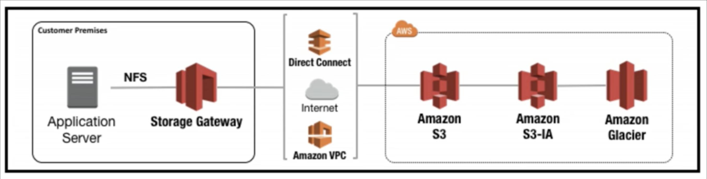
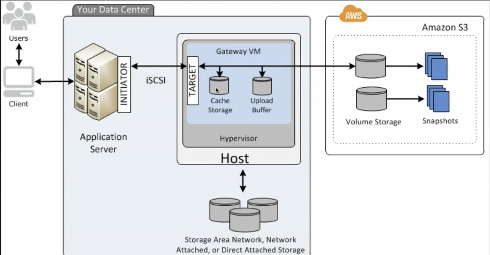

## S3 : General overview

* S3 is object based storage. It is *not intended* to store operating system or database.
* Files can be from 0 to 5TB
* Storage is "unlimited"
* Files are stored in buckets (folders)
* S3 namespace is universal (bucket names must be unique globally)
* S3 file URL pattern : https://<region>.amazonaws.com/<bucket-name>

Consistency :
- After write of a new object, it is immediately available : read after write consistency for PUTS of new objects
- overwrite PUTS and DELETE are eventually consistent : read of modifications are not immediately reflected. But it is atomic.

Storage classes/tiers
- S3 : durable, immediately available, frequently accessed
- S3 infrequent access (IA) : durable, immediately available, infrequently accessed
- S3 Reduced Redundancy Storage : data that can be reproduced easily (ex : thumbnails)
- Glacier : archived data (3 to 5 hours to be retrieved)

S3 object
- key (name) - alphabetiacally ordered across S3 facilities
- value : the data
- version ID
- metadata
- subresources : ACL
- Torrent

Successful upload return 

Read S3 FAQ !!!

## S3 Lab 1

### S3 Buckets

- Buckets names are in a universal namespace
- S3 successful object upload returns HTTP 200
- 3 storage options : S3 Standard, IA, RRS
- Encryption options
    - Client side
    - Server side
        - Server side with AWS S3 managed keys (SSE-S3)
        - Server side with KMS (SSE-KMS)
        - Server side with Customer provided keys (SSE-C)
    
2 ways to control access permissions to buckets :

- Access control List
- Bucket Policies

By default buckets are private and all objects stored in buckets are private

### S3 Version control

- Storing all versions of an object
- Backup tool
- Once enabled can't be disabled, only suspended
- Integrates lifecycle rules
- MFA delete capability (for Multi Factor Authentication)

### S3 Cross region replication

- Versioning must be enabled on both source and destination buckets
- Regions must be unique
- Files pre-existing in a bucket a are not replicated automatically. Subsequent updated files are replicated automatically
- Delete marker are replicated
- Delting files or delete marker is not replicated
- You can't replicate to multiple buckets

### S3 IA, Glacier and lifecycle management

Lifecycle management is there to save money by transitioning buckets (or subfolders) to less costly storage tier classes (IA, Glacier)

- Lifecycle management can be used in conjunction with versioning
- It can be applied to current or previous version
- The following actions can be done :
    - Transition to IA Storage class (128 kb and 30 days after the object creation)
    - Archive to Glacier (30 days after transitioning tpo IA if relevant)
    - Permanently delete
    
### Cloud front CDN

* Edge location : An Edge location is a location where the content is cached.
It is separate from an AWS region or an availability zone.

* Origin : it is the origin from which the files are distributed. It can be an S3 bucket, an EC2 instance, an ELB or Route 53.

* Distribution : it is the name given to a CDN which consists of a set of Edge Locations. There are 2 types of distributions :
    * Web distributions for web sites
    * RTMP for media streaming

* It is possible to write to an Edge location

* Objects are cached for a TTL

* It is possible to clear objects from the cache before the end of the TTL, but it is charged

### Security and encryption

Security access

* Buckets are private by default
* Access control :
    * Bucket policies - bucket wide
    * ACL - policy, drill down to individual ojbects
* Logs can be activated to log all request to access to buckets

Encryption

* 4 methods
* 2 types
    * In transit : SSL / TLS (HTTPS)
    * At rest : 4 methods
        * Server Side encryption
            * S3 managed keys : keys are also encrypted with a rotating master key
            * S3 encryption with AWS KMS managed keys - audit trail of the keys - audit trail of decryption
            * SSE - C : Keys are provided by the customer
            
        * Client side encryption : the data is encrypted on the client side
            
    
### Storage Gateway

Connects an on-premise software appliance with a cloud based storage to provide seamless integration.

* Virtual appliance installed in the data center
* It support Microsoft Hypervisor or VMWare ESXi

4 types :

* File Gateway (NFS) : for files
* Volume Gateway (iSCSI) : for block storage (DB, OS ...)
    * Stored volumes
    * Cached volumes
* Tape Gateway (VTL) : archiving to Glacier (Gateway Virtual Tape ) 

Direct Connect : dedicated communication line
VPC : Virtual Private Cloud

Volume Gateway - *Stored volumes* : virtual hard disk on premise -> back up in S3 as EBS Storage.
It's a complete copy on premise, backed up in S3. Up to 16TB. iSCSI.

Volume Gateway - *Cached volumes* : recently read data is retained on premise. Written data is sent to S3. Up to 32TB. Most of the data is stored on AWS. iSCSI.

*Summary :*

* File gateway : for flat files only stored directly on S3 (no storage on premise)
* Volume gateway : use iSCSI protocol. 
    * Stored volumes : entire data set stored on premise, backed up in S3.
    * Cached volumes : only most recently read data is stored on premise
    * Virtual Tape Library : for backup used with popular applications like etbackup, Veeam ...

Note iSCSI : internet Small Computer System Interface. Protocol for storage over the network. Can be used in both LAN and WAN. Used in SAN. Does not require a dedicated infrastructure. SCSI over IP. 