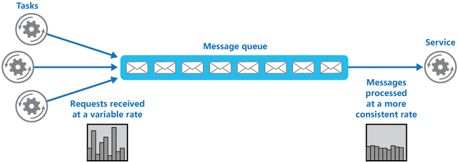

## Cloud application patterns

### State management

Application frequently need to manage state, for example the information that has been entered by the end user since the beginning of its session.

*Beware of elements of architecture impeaching scalability*

When the application is scaled out, it might become a weak point of the architecture, for example if it creates a session affinity between a client and a server instance.

Likewise, an application which is storing the result of a computation on a disk through a database system can cause difficulty to scale geographically because additional configuration would be required to synchronize databases on each instance disk. 

### Stateless design

In order to meet scalability requirement an application must be stateless to allow request to be routed to any instance of the services.

If the application needs to maintain state, the data should be stored in a distributed storage mechanism such as a Document DB or a HBase.

Session state of web application can be stored in state servers shared amongst all the instances.

## Cloud design pattern

### Challenges

The challenges encoutered can be sorted in the following categories :

* Availability : cloud application should be designed to maximize availability

* Data management : when an application is scaling out, a range of challenges are encountered, such as the maintenance of data consistency 

* Performance and scalability

* Resiliency

* Security

* Monitoring and management

* Messaging

### Design patterns

#### For availability

##### Health Endpoint Monitoring

Implement health monitoring by sending requests to a health endpoint of an application. The application is responsible to perform the checks and to provide a health status. The analysis of the results is performed by the tools or the frameworks that performs the health verification check. 

##### Queue based load leveling

Use a queue which acts as a buffer between a service client and the 
service, in order to smooth intermittent heavy loads.

##### Throttling

Throttling controls the amount of resources consumed by an application, a given service or a tenant.

This patterns helps to keep application responsive with teh expected SLAs.

Throttling should be considered early in the application design, because it is not easy to implement late.

If a response is denied to the user becuse of throttling, a specific error code should be returned to the client.

This pattern can be used for example :

- to ensure that a client meets the service level agreements
- to prevent a single tenant to monopolize resources
- to handle bursts in activity

Throttling depends on telemetry. To apply throttling it should be possible to evaluate the resource consumption.

Throttling or rate limiting can be for example implemented with a filter component, or with a proxy on the web server, in order to capture the stream of incoming requests.

### Data management for performance

#### Cache aside

Use of a distributed cache, ex : Hazelcast.

#### Sharding

Split data logically (using application) or automatically (using database) across machines (shards).

Sharding pattern : lookup strategy - use a map to "route" the queries to the proper shard.

### Resiliency

Transient faults : on a cloud provider, we can't garantee how fast it is going to respond.

Sometimes it a delay can occur due to load on requested a component.

Instead of throwing an error as soon as a response is not obtained in the expected time frame, a retry policy can be set up.

The policy can be based on the status code returned. Some status codes indicates that the call would remain unsuccessful even if it was retried.

Such as : 404 or 400.

Escalating wait policy should be applied in order to avoid to overload the busy service.

