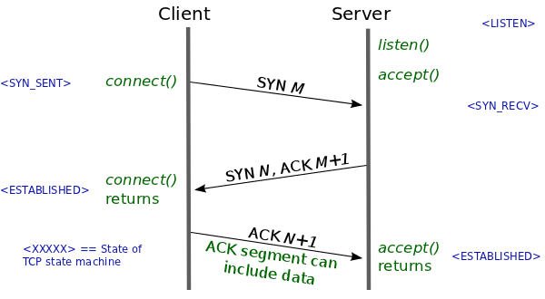

## Networking Protocols 

### TCP IP and OSI Model

There are 2 models used to described the network protocols used for internet communication :

- The TCP IP model - 4 layers
- The OSI model - 7 layer

#### TCP IP Model

1. Application layer
2. Transport layer
3. Network layer
4. Data link layer

##### 1. Application Layer

Top layer of the TCP/IP protocol suite.

As a end user, we are exposed to protocols of this layer through the use of applications.

Application Layer use, amnong others, the following protocols to communicate with the transport layer :

* HTTP
* FTP
* SMTP
* SNMP
* ... 

##### 2. Transport Layer

The most commonly used protocols of this layer are :

* TCP
* UDP

TCP provides a reliable connection, while UDP is used in case of unreliable connections.

###### TCP - Transmission Control Protocol

This protocol is performing the following actions :

- It divides the data into properly sized chunks
- Passes the chunks to the network layer
- Acknowledge received packets
- Waits for acknowledgement of sent packet
- Resends packet if ackowledgements are not received in time
- Ensures ordering of data chunks based on the header

TCP ensures reliable connection, which means that the protocols performs control of the transmitted data (as its name implies) and ensures that packets are not lost.

TCP is allowing multiplexed data.

TCP is adapting the size of data packets to the available bandwidth.

The TCP chunk is structured and contains a lot of information used to ensure the transport, apart from the transported data.

Among these informations, there is :

- The source and destination port
- The sequence number
- The flags such as 

    * ACK indicates that the packet is an acknowledgment
    * SYN indicates that the packet is used to establish a connection and to synchronize sequence
    * RST indicates the connection is reset
    * FIN, the connection terminates
    * PSH, the packet is used with the push method
    * URG, the packet is urgent
    
When the connection is established between the sender and the receiver, the initial sequence number is shared between the two in both directions.

The connection is established through a 3 ways handshake.

The 3 ways handshake is providing a mean to exchange the initial sequence number from client to server and from server to client.

###### UDP - User Datagram Protocol

This protocol is not connection oriented.

It is not ensuring that the data is not lost. It is not performing transmission error control. It is not establishing a connection prior